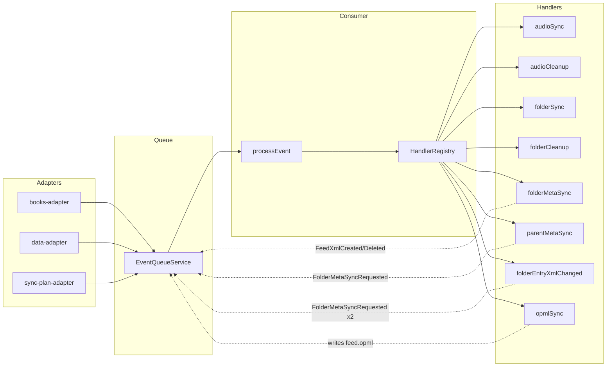
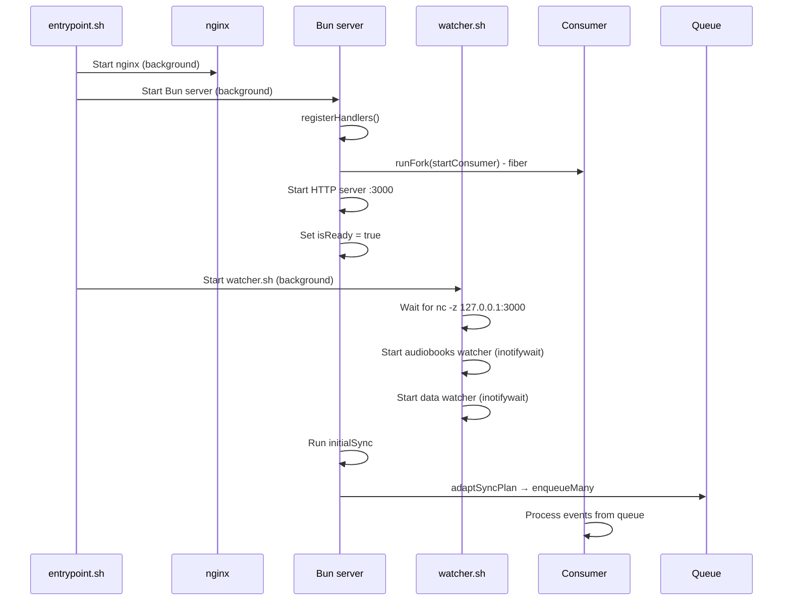

# Event-Driven Architecture

## Overview

The system uses native Linux `inotifywait` to watch two directories:

- `/audiobooks` — source audio files (audiobooks organized in folders)
- `/data` — generated metadata (entry.xml, feed.xml, feed.opml, covers)

Events are sent via HTTP to the server's SimpleQueue for sequential processing.

## Process Architecture

```
entrypoint.sh (PID 1)
├── nginx (background, :80 external)
│   ├── serves /audiobooks/* (audio streaming with Range support)
│   ├── serves /data/* (feed.xml, feed.opml, covers)
│   ├── serves /static/* (CSS, XSLT)
│   └── proxies /resync → Bun (with Basic Auth)
├── Bun server (background, 127.0.0.1:3000)
│   ├── POST /events/books ← audiobooks watcher
│   ├── POST /events/data ← data watcher
│   └── POST /resync
└── watcher.sh (background)
    ├── audiobooks watcher → wget → /events/books
    └── data watcher → wget → /events/data
```

## Dual Watcher System

Two independent inotifywait processes watch different directories:

### Audiobooks Watcher (/audiobooks)

- **Watches:** CREATE, CLOSE_WRITE, DELETE, MOVED_FROM, MOVED_TO
- **Endpoint:** POST /events/books
- **Adapter:** `books-adapter.ts`
- **Events:** AudioFileCreated, AudioFileDeleted, FolderCreated, FolderDeleted

### Data Watcher (/data)

- **Watches:** CLOSE_WRITE, MOVED_TO
- **Endpoint:** POST /events/data
- **Adapter:** `data-adapter.ts`
- **Events:** EntryXmlChanged, FolderEntryXmlChanged
- **Exclusions:** `events.jsonl`, `errors.jsonl`

### Why Two Watchers?

- Separation of concerns: source files vs generated artifacts
- Loop prevention: data changes trigger parent updates without recursive feed regeneration
- Different event sets: audiobooks need full lifecycle, data only needs completion events

## Layered Architecture

```
┌─────────────────────────────────────────────────────────────┐
│ ADAPTERS LAYER                                              │
├─────────────────────────────────────────────────────────────┤
│ books-adapter.ts       │ data-adapter.ts │ sync-plan-adapter│
│ - POST /events/books   │ - POST /events/ │ - scanFiles +    │
│ - raw → EventType      │   data          │   createSyncPlan │
│ - TTL deduplication    │ - entry.xml →   │ - no deduplication│
│ - CLOSE_WRITE →        │   EntryXml-     │                  │
│   AudioFileCreated     │   Changed       │                  │
└────────────┬───────────┴────────┬────────┴────────┬─────────┘
             │                    │                 │
             ▼                    ▼                 ▼
┌─────────────────────────────────────────────────────────────┐
│ QUEUE LAYER                                                 │
├─────────────────────────────────────────────────────────────┤
│ SimpleQueue<EventType>                                      │
│ - enqueue(event) / take(signal) / enqueueMany(events)       │
│ - Unrolled linked list — no per-take allocations            │
│ - Single shared instance via buildContext()                  │
└─────────────────────────┬───────────────────────────────────┘
                          │
                          ▼
┌─────────────────────────────────────────────────────────────┐
│ CONSUMER LAYER                                              │
├─────────────────────────────────────────────────────────────┤
│ processEvent + startConsumer                                │
│ - ctx.handlers.get(event._tag) — registry, NOT imports      │
│ - cascading events → queue.enqueueMany()                    │
│ - error = no cascades, log, continue                        │
└─────────────────────────┬───────────────────────────────────┘
                          │
                          ▼
┌─────────────────────────────────────────────────────────────┐
│ HANDLERS LAYER (business logic)                             │
├─────────────────────────────────────────────────────────────┤
│ audioSync, audioCleanup, folderSync, folderCleanup...       │
│ - (event, deps) => Promise<Result<EventType[], Error>>      │
│ - return cascading events, NOT direct handler calls         │
│ - deps: HandlerDeps = Pick<AppContext, config|logger|fs>    │
└─────────────────────────────────────────────────────────────┘
```

## HTTP API

### Internal Endpoints (Bun server on 127.0.0.1:3000)

| Method | Endpoint      | Purpose                            | Schema        |
| ------ | ------------- | ---------------------------------- | ------------- |
| POST   | /events/books | Receive audiobooks watcher events  | RawBooksEvent |
| POST   | /events/data  | Receive data watcher events        | RawDataEvent  |
| POST   | /resync       | Trigger full resync (clears /data) | -             |

All endpoints return 503 if queue not ready, 202 on success, 400 on schema validation failure.

### Public Endpoints (nginx on :80)

| Path            | Behavior                                      |
| --------------- | --------------------------------------------- |
| `/`             | Redirect → `/feed.opml`                       |
| `/feed.opml`    | Root OPML aggregation                         |
| `/audiobooks/*` | Stream audio files (Range support)            |
| `/static/*`     | Serve from `/app/static/` (1 day cache)       |
| `/resync`       | Auth → proxy to Bun (if ADMIN_USER set)       |
| `/*`            | Serve from `/data/*` (feed.xml, covers, etc.) |

## Raw Event Schemas

Raw events from watcher.sh are validated using inline type guards (`isRawBooksEvent`/`isRawDataEvent`):

### RawBooksEvent

```typescript
{
  parent: string;  // "/audiobooks/Author/Book/"
  name: string;    // "01-chapter.mp3"
  events: string;  // "CREATE,ISDIR" or "CLOSE_WRITE"
}
```

### RawDataEvent

```typescript
{
  parent: string;  // "/data/Author/Book/01-chapter.mp3/"
  name: string;    // "entry.xml"
  events: string;  // "CLOSE_WRITE" or "MOVED_TO"
}
```

## Adapter Classification Logic

### Books Adapter (switch statement)

- CREATE + ISDIR → FolderCreated
- CREATE (file) → Ignored (waits for CLOSE_WRITE)
- CLOSE_WRITE → AudioFileCreated (if valid audio extension)
- DELETE + ISDIR → FolderDeleted
- DELETE (file) → AudioFileDeleted (if valid audio extension)
- MOVED_FROM → Deleted (folder or audio file)
- MOVED_TO → Created (folder or audio file)
- Unknown → Ignored

### Data Adapter (if-else)

- entry.xml → EntryXmlChanged
- \_entry.xml → FolderEntryXmlChanged
- feed.xml, feed.opml, other files → Ignored

### Deduplication

- TTL window: 500ms
- Cleanup threshold: 1000 entries
- Cleanup age: 5000ms
- Returns null if deduplicated, EventType if should process

## DI Services

| Service                | Purpose                                              |
| ---------------------- | ---------------------------------------------------- |
| `ConfigService`        | filesPath, dataPath, baseUrl, port                   |
| `LoggerService`        | info, warn, error, debug (structured JSON to stdout) |
| `FileSystemService`    | mkdir, rm, readdir, stat, atomicWrite                |
| `DeduplicationService` | TTL-based (500ms window) event filtering             |
| `EventQueueService`    | enqueue, enqueueMany, size, take                     |
| `HandlerRegistry`      | Map<tag, handler> — decouples consumer from handlers |

## Event Types

```typescript
type EventType =
  | { _tag: "AudioFileCreated"; parent: string; name: string }
  | { _tag: "AudioFileDeleted"; parent: string; name: string }
  | { _tag: "FolderCreated"; parent: string; name: string }
  | { _tag: "FolderDeleted"; parent: string; name: string }
  | { _tag: "EntryXmlChanged"; parent: string }
  | { _tag: "FolderEntryXmlChanged"; parent: string }
  | { _tag: "FolderMetaSyncRequested"; path: string }
  | { _tag: "FeedXmlCreated"; path: string }
  | { _tag: "FeedXmlDeleted"; path: string }
  | { _tag: "Ignored" };
```

## Cascade Chain

```
AudioFileCreated (audiobooks watcher → books-adapter)
  → audio-sync: read ID3, write entry.xml + folder-level cover.jpg → returns []

  (data watcher detects entry.xml close_write)
  → EntryXmlChanged (data-adapter)
    → parentMetaSync → returns [FolderMetaSyncRequested]
      → folder-meta-sync: read entry.xml files → write feed.xml + _entry.xml
        → returns [FeedXmlCreated] if feed.xml is new
        → returns [FeedXmlDeleted] if last episode removed
        → returns [] if content update only

  FeedXmlCreated (from folder-meta-sync cascade return)
    → opml-sync: collect feed.xml paths → write feed.opml → returns []
```

## Event Flow



## Handlers Reference

| Handler                       | Trigger                 | Returns                            |
| ----------------------------- | ----------------------- | ---------------------------------- |
| `audio-sync.ts`               | AudioFileCreated        | `[]`                               |
| `audio-cleanup.ts`            | AudioFileDeleted        | `[FolderMetaSyncRequested]`        |
| `folder-sync.ts`              | FolderCreated           | `[FolderMetaSyncRequested]`        |
| `folder-cleanup.ts`           | FolderDeleted           | `[FolderMetaSyncRequested]`\*      |
| `folder-meta-sync.ts`         | FolderMetaSyncRequested | `[FeedXmlCreated/Deleted]` or `[]` |
| `parent-meta-sync.ts`         | EntryXmlChanged         | `[FolderMetaSyncRequested]`        |
| `folder-entry-xml-changed.ts` | FolderEntryXmlChanged   | `[FolderMetaSyncRequested x2]`     |
| `opml-sync.ts`                | FeedXmlCreated/Deleted  | `[]`                               |

\*folder-cleanup returns `[]` for root-level folders (no parent to update)

## Startup Sequence



## Critical Pattern: Single AppContext

All services share a single `AppContext` instance created by `buildContext()`. The context holds the queue, handler registry, dedup state, config, logger, and fs — passed explicitly to consumers and handlers.

```typescript
const ctx = await buildContext();
registerHandlers(ctx.handlers);
const consumerTask = startConsumer(ctx, controller.signal);
```

## Mirror Structure

/data mirrors /audiobooks:

```
/audiobooks/Author/Book/01.mp3

/data/
├── feed.opml                     # Root OPML aggregation
├── Author/
│   ├── _entry.xml                # Folder entry (for parent's feed)
│   ├── feed.xml                  # Podcast RSS 2.0 feed
│   ├── cover.jpg                 # Folder cover art (1400px max)
│   └── Book/
│       ├── _entry.xml            # Folder entry (for parent)
│       ├── feed.xml              # Podcast RSS 2.0 feed
│       ├── cover.jpg             # Cover art (1400px max)
│       └── 01.mp3/
│           └── entry.xml         # Cached episode metadata
```

## Structured Logging

### Log System (src/logging/)

- Flat JSON to stdout (Docker-friendly, no file-based logging)
- Log levels: debug, info, warn, error
- Controlled by LOG_LEVEL environment variable

### Event Tracing

Each event receives unique ID for full lifecycle tracking:

- `event_received` — adapter receives raw event
- `event_ignored` — filtered by adapter
- `event_deduplicated` — TTL cache hit
- `handler_start` — handler begins processing
- `handler_complete` — handler finishes successfully
- `handler_error` — handler fails
- `cascades_generated` — handler returns cascade events

## Loop Prevention

| Event        | Watched? | Reason                                  |
| ------------ | -------- | --------------------------------------- |
| `entry.xml`  | Yes      | Triggers parent feed regeneration       |
| `_entry.xml` | Yes      | Triggers own + parent feed regeneration |
| `feed.xml`   | No       | Would cause infinite loop               |
| `feed.opml`  | No       | Would cause infinite loop               |
| `*.tmp`      | No       | Intermediate atomic write files         |
| `*.jsonl`    | No       | Log files                               |

## nginx Integration

### Cache Headers

| File Type | Cache-Control                    |
| --------- | -------------------------------- |
| XML feeds | `no-cache` (always validate)     |
| Images    | `public, must-revalidate, 1 day` |
| Static    | `public, immutable, 1 day`       |

### Special Handling

- ETag support for all files
- Rate limiting for audio streaming (if RATE_LIMIT_MB set)
- 503 with `Retry-After: 5` if feed.opml missing (initializing)
- Basic Auth for /resync (if ADMIN_USER/ADMIN_TOKEN set)
- HTTP Range requests for audio file seeking/streaming

## Resync Endpoint

POST /resync (proxied via nginx with Basic Auth):

1. Check isSyncing flag (409 if already syncing)
2. Set isSyncing = true
3. Clear /data directory contents (not directory itself)
4. Run same sync logic as initialSync
5. try/finally guarantees isSyncing = false on completion or error

Resync is fire-and-forget (returns 202 immediately), logs errors.

## Project Structure

```
src/
├── server.ts        # HTTP server + initial sync + DI setup
├── config.ts        # Environment configuration
├── constants.ts     # File constants (feed.xml, entry.xml, feed.opml, etc.)
├── scanner.ts       # File scanning, sync planning
├── types.ts         # Shared types (MIME_TYPES, AUDIO_EXTENSIONS)
├── watcher.sh       # inotifywait → POST /events
├── audio/           # Audio metadata extraction
│   ├── types.ts     # AudioMetadata interface
│   ├── id3-reader.ts # music-metadata via parseBuffer() (NOT parseFile)
│   └── cover.ts     # Folder cover art finder
├── rss/             # Feed generation
│   ├── types.ts     # PodcastInfo, EpisodeInfo, OpmlOutline
│   ├── podcast-rss.ts # Podcast RSS 2.0 with iTunes namespace
│   └── opml.ts      # OPML 2.0 feed aggregation
├── context.ts       # AppContext, HandlerDeps, buildContext()
├── queue.ts         # SimpleQueue (unrolled linked list)
├── effect/          # Event handling (legacy directory name)
│   ├── types.ts     # RawBooksEvent, RawDataEvent, EventType
│   ├── consumer.ts  # Async event loop with AbortController
│   ├── adapters/    # Raw → typed event conversion
│   │   ├── books-adapter.ts    # /audiobooks watcher events
│   │   ├── data-adapter.ts     # /data watcher events
│   │   └── sync-plan-adapter.ts # Initial sync → events
│   └── handlers/    # audio-sync, folder-sync, opml-sync, etc.
├── logging/         # Structured logging
│   ├── types.ts     # LogLevel, LogContext
│   └── index.ts     # Flat JSON logger to stdout
└── utils/           # image, processor
```

## Testing

Plain mock objects enable unit testing without framework overhead:

```typescript
const deps: HandlerDeps = {
  config: { filesPath: "/audiobooks", dataPath: "/data", port: 3000, reconcileInterval: 1800 },
  logger: { info: () => {}, warn: () => {}, error: () => {}, debug: () => {} },
  fs: { mkdir: async () => {}, rm: async () => {}, ... },
};

const event: EventType = { _tag: "AudioFileDeleted", parent: "/audiobooks/", name: "01.mp3" };
const result = await audioCleanup(event, deps);

expect(result.isOk()).toBe(true);
expect(mockFs.rmCalls).toHaveLength(1);
```

### Test Structure

```
test/
├── setup.ts             # Global test setup
├── helpers/             # Mock services, assertions, fs utils
├── unit/                # Pure logic, no external deps
│   ├── audio/           # ID3 reader, cover finder tests
│   ├── rss/             # RSS + OPML generator tests
│   ├── utils/           # Image processing tests
│   └── effect/handlers/ # Handler unit tests
├── integration/         # Requires docker (ImageMagick, ffmpeg)
│   └── effect/          # Queue + cascade flow tests
└── e2e/                 # Full system tests
    ├── nginx.test.ts    # nginx routing, OPML, range requests
    └── event-logging.test.ts  # Event lifecycle tracing
```
